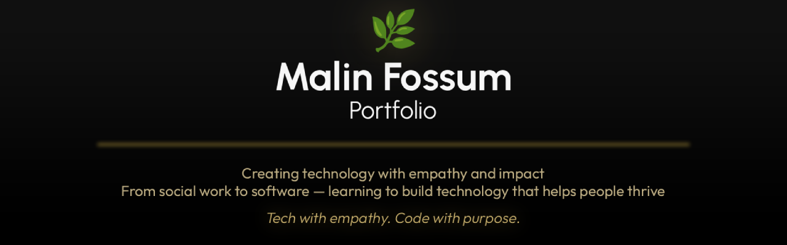

<!-- Banner -->

  

---

## Malin Fossum

IT student at Get Academy (Start IT), transitioning into software development with a background in social work.

I focus on accessibility, user-centered design, and strong fundamentals — learning deeply before scaling complexity.

---

## Current Focus
- HTML, CSS, and JavaScript fundamentals  
- MVC and separation of concerns  
- Accessibility and user-centered design  
- Building small, well-documented applications

---

## Featured Work

### Portfolio Website
Minimal, accessible, performance-focused portfolio built with semantic HTML and structured CSS.

**Live:** https://malinfossum.github.io/portfolio-website/  
**Repo:** https://github.com/malinfossum/portfolio-website

---

### Get Academy — Learning Index
A curated index of my ongoing study projects and exercises from Get Academy.

**Repo:** https://github.com/malinfossum/getacademy

---

## Technical Stack

  
  
  
  
  
  
  

(Actively learning — this list evolves as my projects do.)

---

## About Me

- Social work background with a focus on empathy and accessibility    
- Intentional, structured approach to design and development  
- Lifelong learner 
- Cat & dog parent

---

## Get in touch
- Portfolio: https://malinfossum.github.io/portfolio-website/
- LinkedIn: https://linkedin.com/in/malinfossum
- Email: malinfossum.dev@proton.me

Built with empathy, curiosity, and a love for learning.

> ✨ *Tech with empathy. Code with purpose.* ❤️
