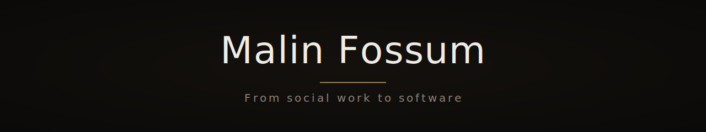

  

    
  

  ---

  # Malin Fossum

  Student developer in Norway, building clean, accessible web apps with a focus on
  structure, clarity, and strong fundamentals.

  From social work to software — bringing empathy and a human-centered mindset into
  technical work.

  ---

  ## How I build

  - Start simple and build on solid fundamentals
  - Separation of concerns — strict MVC
  - Accessible, user-centered interfaces by default
  - Learn deeply before scaling complexity

  ---

  ## Tech

  HTML · CSS · JavaScript · Vite · Biome · Git

  Currently learning IndexedDB, Service Workers, and PWA fundamentals through
  [Ignite](https://github.com/malinfossum/ignite).

  ---

  ## What I'm building

  <!-- DASHBOARD:START -->
  <!-- DASHBOARD:END -->

  ---

  ## Contact

  - Portfolio — <https://malinfossum.github.io/portfolio/>
  - LinkedIn — <https://linkedin.com/in/malinfossum>
  - Email — malinfossum.dev@proton.me
