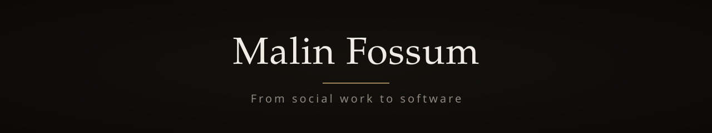
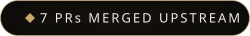

  

# Hi, I'm Malin.

Fullstack developer in Norway: I build clean, accessible apps end to end, with a focus on structure, clarity, and solid fundamentals.

Came to code from social work. The instinct, listening and meeting people where they are, now lives in how I build.

Social work also taught me that progress starts with showing up. On GitHub that means building in the open, and leaving the tools I use better than I found them.

## Workflow

<table align="center">
<tr>
<td valign="top" width="33%">

 <strong>Frontend</strong>

TypeScript · React · JavaScript · HTML · CSS

</td>
<td valign="top" width="33%">

 <strong>Backend</strong>

C# · ASP.NET Core · EF Core · PostgreSQL

</td>
<td valign="top" width="33%">

 <strong>Tools</strong>

Git · Vite · Vitest · NUnit · Claude&nbsp;Code

</td>
</tr>
</table>

## What I'm working on

<!-- DASHBOARD:START -->
<table align="center">
<tr>
<td valign="middle" width="30%">

 <strong>For focus</strong>

<em>Calm tools, built for brains like mine.</em>

</td>
<td valign="top" width="70%">

<a href="https://github.com/malinfossum/tidsro"><strong>tidsro</strong></a> ★ 1: a calm desktop timer & alarm.

<a href="https://github.com/malinfossum/ignite"><strong>ignite</strong></a> ★ 1: ADHD-friendly task app.

</td>
</tr>
<tr>
<td valign="middle" width="30%">

 <strong>For the everyday</strong>

<em>Making ordinary days a little easier.</em>

</td>
<td valign="top" width="70%">

<a href="https://github.com/malinfossum/varde"><strong>varde</strong></a>: a bilingual directory of Norwegian social services.

<a href="https://github.com/malinfossum/kenaz"><strong>kenaz</strong></a>: a private, local-first daily wellbeing check-in.

</td>
</tr>
<tr>
<td valign="middle" width="30%">

 <strong>For momentum</strong>

<em>Overview and rhythm, for the long haul.</em>

</td>
<td valign="top" width="70%">

<a href="https://github.com/wendhq/wend"><strong>wend</strong></a> ★ 2: an accessible, dark-mode-first kanban board. A calm Trello alternative.

<a href="https://github.com/malinfossum/hugin"><strong>hugin</strong></a>: a command-line job radar for the Norwegian dev market.

</td>
</tr>
<tr>
<td valign="middle" width="30%">

 <strong>For everyone</strong>

<em>Open source: showing up for the tools we share.</em>

</td>
<td valign="top" width="70%">

<a href="https://github.com/ChrisTitusTech/winutil"><strong>ChrisTitusTech/winutil</strong></a> ★ 60.9k: accessibility & UX fixes: <a href="https://github.com/ChrisTitusTech/winutil/pull/4992">#4992</a> · <a href="https://github.com/ChrisTitusTech/winutil/pull/4993">#4993</a> · <a href="https://github.com/ChrisTitusTech/winutil/pull/4995">#4995</a>

</td>
</tr>
</table>

<code>13 original projects</code>  <code>C#</code> <code>JavaScript</code> <code>CSS</code>  <code>updated 2026-08-19</code>

<!-- DASHBOARD:END -->

---

  

<em>Flame kindles flame, said Hávamál a thousand years ago, and folk grow wise by talking. 
Progress grows from action. Action grows from will. Will grows from curiosity and empathy. 
Be kind: light the next beacon.</em>

