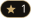
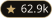
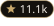

  

# Hi, I'm Malin.

Fullstack developer in Norway: clean, accessible apps built end to end, from the database to the last focus ring, on solid fundamentals.

Accessibility is where I start, not where I finish. I build for all, because it benefits all: a tool, an app or a website should work for everyone, whatever they bring to it. It shows in what I ship, and upstream: my first merged open-source contributions were accessibility fixes.

I came to code from social work: years of listening, meeting people where they are, and untangling systems never designed for the people inside them. That instinct now lives in how I build: in the open, documented as I go, leaving the tools I use better than I found them. Off the clock: a cat, a view over Mjøsa, and a soft spot for how Mercedes engineers the small details. Still looking for a game that feels like the original Black Ops, Halo Reach and San Andreas did. GTA VI, no pressure.

---

## Workflow

<table align="center">
<tr>
<td valign="top" width="33%">

 <strong>Frontend</strong>

TypeScript · React · JavaScript · HTML · CSS

</td>
<td valign="top" width="33%">

 <strong>Backend</strong>

C# · ASP.NET Core · EF Core · PostgreSQL

</td>
<td valign="top" width="33%">

 <strong>Tools</strong>

Git · Vite · Vitest · NUnit · Claude&nbsp;Code

</td>
</tr>
</table>

---

## What I'm working on

<!-- DASHBOARD:START -->
<table align="center">
<tr>
<td valign="middle" width="30%">

 <strong>For focus</strong>

<em>Calm tools, built for brains like mine.</em>

</td>
<td valign="top" width="70%">

<a href="https://github.com/malinfossum/tidsro"><strong>tidsro</strong></a>&ensp;&nbsp;&ensp;&nbsp;a calm desktop timer &amp; alarm for Windows.

<a href="https://github.com/malinfossum/ignite"><strong>ignite</strong></a>&ensp;&nbsp;&ensp;&nbsp;ADHD-friendly task app.

</td>
</tr>
<tr>
<td valign="middle" width="30%">

 <strong>For wellbeing</strong>

<em>Making life a little easier.</em>

</td>
<td valign="top" width="70%">

<a href="https://github.com/malinfossum/varde"><strong>varde</strong></a>&ensp;&nbsp;a bilingual directory of Norwegian social services.

<a href="https://github.com/malinfossum/kenaz"><strong>kenaz</strong></a>&ensp;&nbsp;private, local-first daily wellbeing check-in.

</td>
</tr>
<tr>
<td valign="middle" width="30%">

 <strong>For momentum</strong>

<em>Keeping the work visible and moving.</em>

</td>
<td valign="top" width="70%">

<a href="https://github.com/wendhq/wend"><strong>wend</strong></a>&ensp;&nbsp;&ensp;&nbsp;a calm, accessible kanban board.

<a href="https://github.com/malinfossum/hugin"><strong>hugin</strong></a>&ensp;&nbsp;job radar for the Norwegian developer job market.

<a href="https://github.com/malinfossum/munin"><strong>munin</strong></a>&ensp;&nbsp;local semantic search over your AI memory files.

</td>
</tr>
<tr>
<td valign="middle" width="30%">

 <strong>For everyone</strong>

<em>Open source: showing up for the tools we share.</em>

</td>
<td valign="top" width="70%">

 

<a href="https://github.com/ChrisTitusTech/winutil"><strong>ChrisTitusTech/winutil</strong></a>&ensp;&nbsp;&ensp;&nbsp;<a href="https://github.com/ChrisTitusTech/winutil/pull/4992">#4992</a> · <a href="https://github.com/ChrisTitusTech/winutil/pull/4993">#4993</a> · <a href="https://github.com/ChrisTitusTech/winutil/pull/4995">#4995</a> · <a href="https://github.com/ChrisTitusTech/winutil/pull/5034">#5034</a>

<a href="https://github.com/microsoft/winget-pkgs"><strong>microsoft/winget-pkgs</strong></a>&ensp;&nbsp;&ensp;&nbsp;<a href="https://github.com/microsoft/winget-pkgs/pull/423445">#423445</a>

</td>
</tr>
</table>

<code>14 original projects</code>  <code>C#</code> <code>JavaScript</code> <code>TypeScript</code>  <code>updated 2026-09-19</code>

<!-- DASHBOARD:END -->

---

  

<em>Flame kindles flame, said Hávamál a thousand years ago, and folk grow wise by talking. 
Action lights progress. Will lights action. Curiosity and empathy light the will. 
Be kind: light the next beacon. Someone will steer by it.</em>

